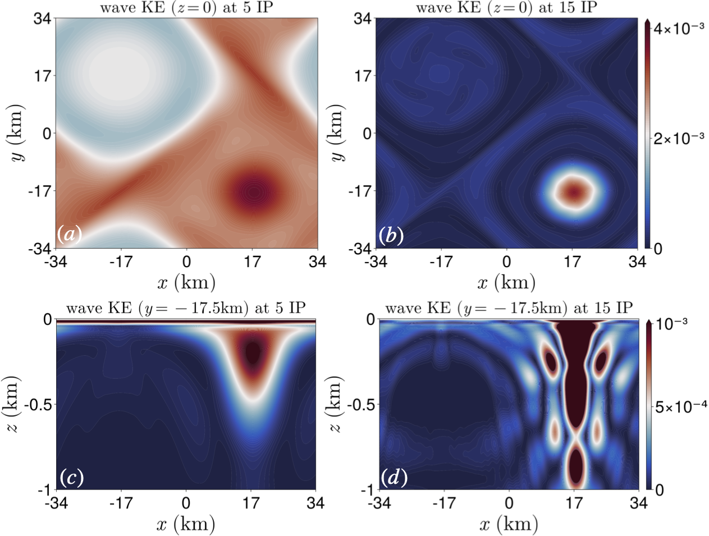

QG-YBJ+ Model
==============

[](https://github.com/subhk/QGYBJplus.jl/actions/workflows/ci.yml)
[](https://subhk.github.io/QGYBJplus.jl/stable/)
[](https://subhk.github.io/QGYBJplus.jl/dev/)

This numerical model simulates the coupling between near-inertial waves and (Lagrangian-mean) balanced eddies. Wave dynamics follow the YBJ+ equation (Asselin & Young 2019), while potential vorticity evolution is governed by the quasigeostrophic equation, incorporating the wave feedback formulation of Xie & Vanneste (2015). The model employs pseudo-spectral methods horizontally, second-order finite differencing vertically, and a second-order exponential Runge-Kutta time stepper.



## Quick Start

```julia
using QGYBJplus

grid = RectilinearGrid(size=(64, 64, 32),
                       extent=(500e3, 500e3, 4000.0))

model = QGYBJModel(grid=grid,
                   coriolis=FPlane(f=1e-4),
                   stratification=ConstantStratification(N²=1e-5),
                   feedback=:wave_mean)

set!(model;
     waves=SurfaceWave(amplitude=0.05, scale=500.0))

simulation = Simulation(model;
                        Δt=300.0,
                        stop_iteration=200,
                        output=NetCDFOutput(path="output",
                                            schedule=TimeInterval(inertial_period(model))))

run!(simulation)
finalize_simulation!(simulation)
```

The lower-level grid, transform, and MPI routines remain available for method
development, but examples should prefer the model/simulation interface above.

## Model Conventions

- Equations are solved in dimensional form. The legacy `QG-YBJp/` Fortran code is nondimensional, so coefficients such as `f₀²/N²` and `f₀/2` are intentional here.
- The prognostic PV field is balanced-flow `q`. When wave feedback is enabled, the code forms `q* = q - qʷ` only as the right-hand side for the streamfunction inversion.
- Horizontal fields are spectral; vertical derivatives use finite differences on cell-centered depths `z ∈ [-Lz, 0]`.

## Source Map

- `src/parameters.jl`, `src/grid.jl`, `src/runtime.jl`: user parameters, grid/state allocation, and setup helpers.
- `src/timestep.jl`: second-order exponential Runge-Kutta time stepping.
- `src/elliptic.jl`: QGPV, Helmholtz, and YBJ+ elliptic inversions.
- `src/nonlinear.jl`: advection, refraction, wave feedback, dissipation, and integrating factors.
- `src/model_interface.jl`, `src/simulation.jl`, `src/config.jl`: higher-level user-facing simulation API.
- `docs/src/`: expanded user guide and API documentation.

## References

- Asselin, O., & Young, W. R. (2019). Penetration of wind-generated near-inertial waves into a turbulent ocean. *J. Phys. Oceanogr.*, 49, 1699-1717.
- Xie, J.-H., & Vanneste, J. (2015). A generalised-Lagrangian-mean model of the interactions between near-inertial waves and mean flow. *J. Fluid Mech.*, 774, 143-169.
